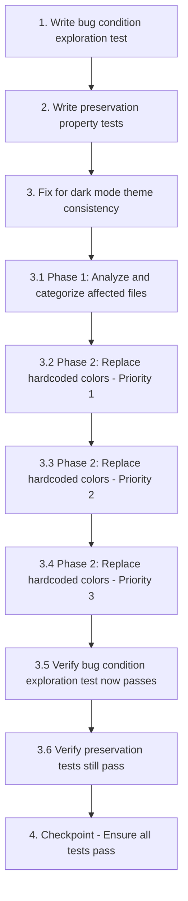

# Implementation Plan

## Overview

This implementation plan follows the bugfix workflow using the bug condition methodology to fix dark mode theme consistency issues. The workflow consists of three phases:

1. **Exploration Phase**: Write property-based tests to identify and document the bug (white/light areas in dark mode)
2. **Preservation Phase**: Write property-based tests to ensure light mode and intentional white elements remain unchanged
3. **Implementation Phase**: Systematically replace hardcoded light colors with adaptive theme-aware colors

The bug affects 40+ screens where hardcoded light colors (`AppColors.white`, `Color(0xFFFFFFFF)`, `Color(0xFFF5F7FA)`) do not respond to dark mode theme changes.

## Tasks

- [ ] 1. Write bug condition exploration test
  - **Property 1: Bug Condition** - Dark Mode Displays White/Light Areas
  - **CRITICAL**: This test MUST FAIL on unfixed code - failure confirms the bug exists
  - **DO NOT attempt to fix the test or the code when it fails**
  - **NOTE**: This test encodes the expected behavior - it will validate the fix when it passes after implementation
  - **GOAL**: Surface counterexamples that demonstrate the bug exists
  - **Scoped PBT Approach**: For deterministic bugs, scope the property to the concrete failing case(s) to ensure reproducibility
  - Test that when dark mode is enabled (AppColors._brightness == Brightness.dark) AND a widget uses hardcoded light colors (AppColors.white, Color(0xFFFFFFFF), Color(0xFFF5F7FA)), the widget displays white or light gray areas instead of dark colors
  - Test implementation details from Bug Condition in design:
    - Manually inspect priority screens (Settings, Home, Meal List, Profile, Workout) in dark mode on UNFIXED code
    - Document each instance of white/light areas with screenshots and file locations
    - Verify that widgets using `AppColors.white`, `Color(0xFFFFFFFF)`, or `Color(0xFFF5F7FA)` display light colors in dark mode
    - Confirm root cause: hardcoded light colors do not respond to theme changes
  - The test assertions should match the Expected Behavior Properties from design:
    - All backgrounds should use dark colors (0xFF0D0D0D, 0xFF1A1A1A, 0xFF1F1F1F)
    - All text should use light colors (0xFFF5F5F5, 0xFFB0B0B0, 0xFF707070)
    - No white or light gray areas should appear (except intentional white elements)
  - Run test on UNFIXED code
  - **EXPECTED OUTCOME**: Test FAILS (this is correct - it proves the bug exists)
  - Document counterexamples found to understand root cause:
    - List all screens with white/light areas in dark mode
    - List all files containing hardcoded light colors
    - Categorize by pattern (AppColors.white, Color(0xFFFFFFFF), Color(0xFFF5F7FA))
  - Mark task complete when test is written, run, and failure is documented
  - _Requirements: 1.1, 1.2, 1.3, 1.4, 1.5_

- [ ] 2. Write preservation property tests (BEFORE implementing fix)
  - **Property 2: Preservation** - Light Mode and Intentional White Elements
  - **IMPORTANT**: Follow observation-first methodology
  - Observe behavior on UNFIXED code for non-buggy inputs:
    - Test all screens in light mode - verify they display light color palette (background: 0xFFF5F7FA, surface: 0xFFFFFFFF, surfaceLight: 0xFFEEF0F4)
    - Test intentional white elements - verify `AppColors.textOnPrimary` displays white (0xFFFFFFFF) on teal buttons in both themes
    - Test brand colors - verify primary teal (#1D6766) and accent orange (#FB3A01) remain constant in both themes
    - Test semantic colors - verify error, success, warning, info colors remain constant in both themes
    - Test feature accent colors - verify energyOrange, streakPurple, waterBlue, heartRed remain constant in both themes
    - Test gradients - verify primaryGradient, accentGradient, darkFade, splashGradient render correctly in their respective themes
    - Test onboarding shader fix - verify it continues to work without regression
  - Write property-based tests capturing observed behavior patterns from Preservation Requirements:
    - For all screens in light mode, visual appearance should match baseline (before fix)
    - For all intentional white elements (textOnPrimary, brand elements), color should remain white (0xFFFFFFFF) in both themes
    - For all brand/semantic/accent colors, values should remain constant across both themes
    - For all gradients, rendering should match expected theme-specific gradients
  - Property-based testing generates many test cases for stronger guarantees
  - Run tests on UNFIXED code
  - **EXPECTED OUTCOME**: Tests PASS (this confirms baseline behavior to preserve)
  - Mark task complete when tests are written, run, and passing on unfixed code
  - _Requirements: 3.1, 3.2, 3.3, 3.4, 3.5, 3.6, 3.7, 3.8_

- [ ] 3. Fix for dark mode theme consistency

  - [ ] 3.1 Phase 1: Analyze and categorize affected files
    - Review grep search results to identify all files with hardcoded light colors
    - Categorize each instance as:
      - Background color (needs AppColors.background, AppColors.surface, or AppColors.surfaceLight)
      - Text color (needs AppColors.textPrimary, AppColors.textSecondary, or AppColors.textTertiary)
      - Opacity effect (needs adaptive equivalent with .withValues(alpha: X))
      - Intentional white element (preserve as-is: AppColors.textOnPrimary, brand elements, white overlays on colored backgrounds)
    - Create prioritized list of files to update (Priority 1: Settings, Home, Meal, Profile screens)
    - _Bug_Condition: isBugCondition(widget) = AppColors._brightness == Brightness.dark AND (widget.usesColor(AppColors.white) OR widget.usesColor(Color(0xFFFFFFFF)) OR widget.usesColor(Color(0xFFF5F7FA))) AND NOT isIntentionalWhiteElement(widget)_
    - _Expected_Behavior: expectedBehavior(result) = result.backgroundColor IN [0xFF0D0D0D, 0xFF1A1A1A, 0xFF1F1F1F] AND result.textColor IN [0xFFF5F5F5, 0xFFB0B0B0, 0xFF707070] AND NOT hasWhiteAreas(result)_
    - _Preservation: Light mode appearance (background: 0xFFF5F7FA, surface: 0xFFFFFFFF), intentional white elements (textOnPrimary: 0xFFFFFFFF), brand colors (primary: #1D6766, accent: #FB3A01), semantic colors, feature accent colors, gradients, onboarding shader fix_
    - _Requirements: 1.1, 1.2, 1.3, 1.4, 1.5, 2.1, 2.2, 2.3, 2.4, 2.5, 3.1, 3.2, 3.3, 3.4, 3.5, 3.6, 3.7, 3.8_

  - [ ] 3.2 Phase 2: Replace hardcoded colors systematically (Priority 1 files)
    - **Pattern 1**: Replace `AppColors.white` with adaptive getters
      - Background colors: `color: AppColors.white` → `color: AppColors.surface` or `color: AppColors.background`
      - Text colors: `color: AppColors.white` → `color: AppColors.textPrimary` (EXCEPT textOnPrimary on buttons)
      - Opacity effects: `AppColors.white.withValues(alpha: X)` → `AppColors.surface.withValues(alpha: X)` or `AppColors.textPrimary.withValues(alpha: X)` (EXCEPT white overlays on colored backgrounds)
    - **Pattern 2**: Replace hardcoded `Color(0xFFFFFFFF)` with adaptive getters
      - Backgrounds: `Color(0xFFFFFFFF)` → `AppColors.surface`
      - Text: `Color(0xFFFFFFFF)` → `AppColors.textPrimary`
    - **Pattern 3**: Replace hardcoded `Color(0xFFF5F7FA)` with adaptive getters
      - Screen backgrounds: `Color(0xFFF5F7FA)` → `AppColors.background`
      - Elevated surfaces: `Color(0xFFF5F7FA)` → `AppColors.surfaceLight`
    - **Pattern 4**: Preserve intentional white elements
      - DO NOT CHANGE: `AppColors.textOnPrimary` (white text on teal buttons)
      - DO NOT CHANGE: White overlays on colored backgrounds (e.g., `AppColors.white.withValues(alpha: 0.2)` on teal gradient cards)
      - DO NOT CHANGE: Brand colors, semantic colors, feature accent colors
    - **Pattern 5**: Update DatePicker theme in meal_list_screen.dart
      - Replace hardcoded dark theme colors with adaptive colors using `AppColors._brightness`, `AppColors.surface`, `AppColors.textPrimary`
    - Apply patterns to Priority 1 files:
      - `lib/screens/meal/meal_list_screen.dart`
      - `lib/widgets/meal/budget_progress_card.dart`
      - `lib/widgets/meal/meal_section_card.dart`
      - `lib/screens/workout/workout_complete_screen.dart`
    - _Bug_Condition: isBugCondition(widget) from design_
    - _Expected_Behavior: expectedBehavior(result) from design_
    - _Preservation: Preservation Requirements from design_
    - _Requirements: 1.1, 1.2, 1.3, 1.4, 1.5, 2.1, 2.2, 2.3, 2.4, 2.5, 3.1, 3.2, 3.3, 3.4, 3.5, 3.6, 3.7, 3.8_

  - [ ] 3.3 Phase 2: Replace hardcoded colors systematically (Priority 2 files)
    - Apply same patterns to Priority 2 files:
      - `lib/widgets/workout/day_carousel_card.dart`
      - `lib/widgets/progress/add_weight_sheet.dart`
      - `lib/widgets/progress/score_ring.dart`
      - `lib/widgets/workout/exercise_list_tile.dart`
    - _Bug_Condition: isBugCondition(widget) from design_
    - _Expected_Behavior: expectedBehavior(result) from design_
    - _Preservation: Preservation Requirements from design_
    - _Requirements: 1.1, 1.2, 1.3, 1.4, 1.5, 2.1, 2.2, 2.3, 2.4, 2.5, 3.1, 3.2, 3.3, 3.4, 3.5, 3.6, 3.7, 3.8_

  - [ ] 3.4 Phase 2: Replace hardcoded colors systematically (Priority 3 files)
    - Apply same patterns to all remaining files identified in grep search (estimated 30+ files)
    - Review each file to ensure correct adaptive getter is used for each context
    - _Bug_Condition: isBugCondition(widget) from design_
    - _Expected_Behavior: expectedBehavior(result) from design_
    - _Preservation: Preservation Requirements from design_
    - _Requirements: 1.1, 1.2, 1.3, 1.4, 1.5, 2.1, 2.2, 2.3, 2.4, 2.5, 3.1, 3.2, 3.3, 3.4, 3.5, 3.6, 3.7, 3.8_

  - [ ] 3.5 Verify bug condition exploration test now passes
    - **Property 1: Expected Behavior** - Dark Mode Displays Consistent Dark Colors
    - **IMPORTANT**: Re-run the SAME test from task 1 - do NOT write a new test
    - The test from task 1 encodes the expected behavior
    - When this test passes, it confirms the expected behavior is satisfied
    - Run bug condition exploration test from step 1:
      - Manually inspect all 40+ screens in dark mode on FIXED code
      - Verify no white or light gray areas appear (except intentional white elements)
      - Verify all backgrounds use dark colors (0xFF0D0D0D, 0xFF1A1A1A, 0xFF1F1F1F)
      - Verify all text uses light colors (0xFFF5F5F5, 0xFFB0B0B0, 0xFF707070)
      - Verify theme transitions are smooth without glitches
    - **EXPECTED OUTCOME**: Test PASSES (confirms bug is fixed)
    - _Requirements: 2.1, 2.2, 2.3, 2.4, 2.5_

  - [ ] 3.6 Verify preservation tests still pass
    - **Property 2: Preservation** - Light Mode and Intentional White Elements Unchanged
    - **IMPORTANT**: Re-run the SAME tests from task 2 - do NOT write new tests
    - Run preservation property tests from step 2:
      - Verify all screens display identical appearance in light mode (before vs after fix)
      - Verify white text on teal buttons remains white in both themes
      - Verify brand colors (teal, orange) remain constant in both themes
      - Verify semantic colors remain constant in both themes
      - Verify feature accent colors remain constant in both themes
      - Verify gradients render correctly in both themes
      - Verify onboarding shader fix continues to work
    - **EXPECTED OUTCOME**: Tests PASS (confirms no regressions)
    - Confirm all tests still pass after fix (no regressions)
    - _Requirements: 3.1, 3.2, 3.3, 3.4, 3.5, 3.6, 3.7, 3.8_

- [ ] 4. Checkpoint - Ensure all tests pass
  - Run all unit tests, property-based tests, and integration tests
  - Verify all screens render correctly in both light and dark mode
  - Verify theme switching works smoothly without glitches
  - Verify no visual regressions in light mode
  - Verify consistent dark colors in dark mode across all 40+ screens
  - If any issues arise, ask the user for guidance before proceeding

## Task Dependency Graph



```json
{
  "waves": [
    {
      "name": "Wave 1: Test Preparation",
      "tasks": ["1", "2"]
    },
    {
      "name": "Wave 2: Analysis",
      "tasks": ["3.1"]
    },
    {
      "name": "Wave 3: Implementation - Priority 1",
      "tasks": ["3.2"]
    },
    {
      "name": "Wave 4: Implementation - Priority 2",
      "tasks": ["3.3"]
    },
    {
      "name": "Wave 5: Implementation - Priority 3",
      "tasks": ["3.4"]
    },
    {
      "name": "Wave 6: Verification",
      "tasks": ["3.5", "3.6"]
    },
    {
      "name": "Wave 7: Final Checkpoint",
      "tasks": ["4"]
    }
  ]
}
```

**Dependencies:**
- Task 1 must complete before Task 2 (need to document bug before writing preservation tests)
- Task 2 must complete before Task 3 (need baseline behavior documented before implementing fix)
- Tasks 3.1-3.4 must complete sequentially (systematic file-by-file replacement)
- Task 3.5 depends on Tasks 3.1-3.4 (verify fix after implementation)
- Task 3.6 depends on Task 3.5 (verify no regressions after fix validation)
- Task 4 depends on all previous tasks (final checkpoint)

## Notes

### Bug Condition Methodology

This bugfix uses the bug condition methodology:
- **C(X)**: Bug Condition - `AppColors._brightness == Brightness.dark AND widget uses hardcoded light colors AND NOT intentional white element`
- **P(result)**: Expected Behavior - `backgrounds use dark colors (0xFF0D0D0D, 0xFF1A1A1A, 0xFF1F1F1F) AND text uses light colors (0xFFF5F5F5, 0xFFB0B0B0, 0xFF707070) AND no white areas`
- **¬C(X)**: Non-buggy inputs - `light mode OR intentional white elements (textOnPrimary, brand elements)`
- **F**: Original (unfixed) function - Current codebase with hardcoded light colors
- **F'**: Fixed function - Codebase with adaptive theme-aware colors

### Testing Strategy

**Exploration Test (Task 1):**
- Manual inspection of priority screens in dark mode
- Document all instances of white/light areas with screenshots
- Expected to FAIL on unfixed code (confirms bug exists)
- Expected to PASS after fix (confirms bug is resolved)

**Preservation Tests (Task 2):**
- Property-based tests for light mode appearance
- Property-based tests for intentional white elements
- Property-based tests for brand/semantic/accent colors
- Expected to PASS on unfixed code (baseline behavior)
- Expected to PASS after fix (no regressions)

### Implementation Patterns

**Pattern 1: Background Colors**
- `AppColors.white` → `AppColors.surface` or `AppColors.background`
- `Color(0xFFFFFFFF)` → `AppColors.surface`
- `Color(0xFFF5F7FA)` → `AppColors.background` or `AppColors.surfaceLight`

**Pattern 2: Text Colors**
- `AppColors.white` → `AppColors.textPrimary` (except textOnPrimary)
- `Color(0xFFFFFFFF)` → `AppColors.textPrimary`

**Pattern 3: Opacity Effects**
- `AppColors.white.withValues(alpha: X)` → `AppColors.surface.withValues(alpha: X)` or `AppColors.textPrimary.withValues(alpha: X)`
- Exception: White overlays on colored backgrounds (preserve as-is)

**Pattern 4: Intentional White Elements (DO NOT CHANGE)**
- `AppColors.textOnPrimary` (white text on teal buttons)
- White overlays on colored backgrounds
- Brand colors, semantic colors, feature accent colors

### Affected Files

**Priority 1 (Core Screens):**
- `lib/screens/meal/meal_list_screen.dart`
- `lib/widgets/meal/budget_progress_card.dart`
- `lib/widgets/meal/meal_section_card.dart`
- `lib/screens/workout/workout_complete_screen.dart`

**Priority 2 (Secondary Widgets):**
- `lib/widgets/workout/day_carousel_card.dart`
- `lib/widgets/progress/add_weight_sheet.dart`
- `lib/widgets/progress/score_ring.dart`
- `lib/widgets/workout/exercise_list_tile.dart`

**Priority 3 (Remaining Files):**
- Estimated 30+ additional files identified in grep search

### Risk Mitigation

- Systematic file-by-file replacement reduces risk of breaking changes
- Preservation tests ensure light mode remains unchanged
- Manual inspection of all screens before and after fix
- Prioritized approach allows early validation on critical screens
